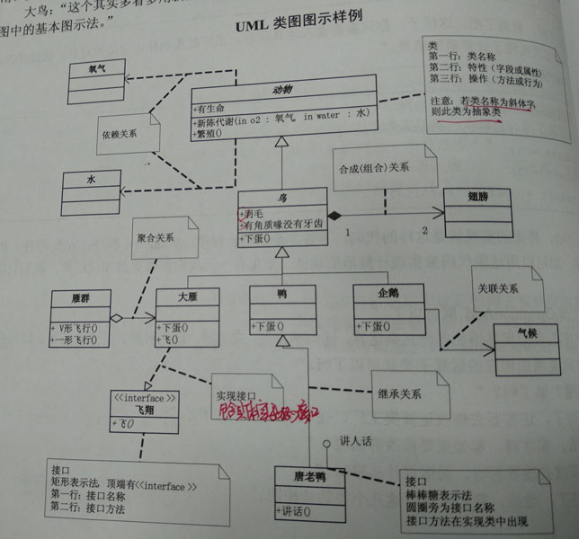

# 简单工厂模式
- C#(C Sharp)是微软推出的一种基于.NET框架、面向对象的高级编程语言。
  - 是微软推出的希望借助取代Java的语言。
  - 其C Sharp的命名表示微软希望这门语言在一些语言特性方面对C++会有提升(其中一项就是GC,Garbage Collection)。

- C#与Java的主要差异来自
  - C#对`子类继承父类`或`实现接口`都是用的`:`，
  - Java对继承和实现接口的语法是不同的。
```java
public class Cat extends Animal //继承
public class Superman implements IFly //接口实现 
```
- 在Ubuntu下运行C#程序
  - 法1：安装runtime环境`mono`IDE，`sudo apt install monodevelop`.
  - 法2：[安装.NET SDK](https://www.microsoft.com/net/learn/get-started/linux/ubuntu16-04)

## 关于面向对象的好处的理解
- 活字印刷与面向对象
  - 要改，只需更改要改的字，此为**可维护**;
  - 这些字不止在这次印刷中有用，在后来的印刷中也可以重复使用，此为**可复用**;
  - 诗若要加字，只需另刻字加入即可，这是**可扩展**;
  - 字的排列可以是横排竖排各种组织方式，移动活字即可，这是**灵活性好**。
- 面向对象的好处
  - 面向对象编程，通过封装、继承、多态可以把**程序的耦合度降低**;
  - 设计模式使得程序更加的灵活，容易修改，并且容易复用。
- 封装、继承与多态(计算器为例)
  - 业务的封装：让**业务逻辑和界面逻辑分开**(class Operarion和class GUI或main)，使之间的耦合度降低(松耦合&&紧耦合)，以达到易维护和易扩展(可以适用不同平台)。
  - 继承可以让代码重用性高，又能适用不同应用场景/情况，并且保持比较良好的隐蔽性。
  - 多态的情况可以使一个指针指向同一父类派生出的多个子类对象，这样操控就能比较灵活。>>但是如何让别人清楚地看到实例化的是哪一个类呢？

- 要使读者清晰了解根据简单的输入**具体实例化的是哪个类**，可以考虑用一个单独的类做这个创造实例的过程。这就是**工厂**。
  - 如果需要增加新的运算符，从父类继承出一个新的子运算类，再在工厂中增加相应的条目即可。(多态+工厂->易扩展和可读性好)
  - 如果需要修改其中一个运算符，从相应的子类做更改即可，不需要影响到其他运算类。(继承->松耦合->易维护)

```c#
//简单工厂模式：多态+工厂
public class OperationFactory
{
	public static Operation createOperation(string operate)
	{
		operation=null;
		switch (operate)
		{
			case "+":
				oper = new OperationAdd();
				break;
			case "-":
				oper = new OperationSub();
				break;
			case "*":
				oper = new OperationMul();
				break;
			case "/":
				oper = new OperartionDiv();
				break;
		}
		return oper;
	}
}
```

## UML类图
UML for Unified Modeling Language，统一建模语言。

- UML模型图汇总


- **类图**分为三层("动物"类)
  - 第一层显示类的名称，如果是抽象类，就用斜体显示;
  - 第二层是类的特性，通常是字段或属性(成员变量);
  - 第三层是类的操作，通常是方法或行为(成员函数)。

- 接口的两种表示方法
  - **接口图**(左下角"飞翔"实现接口)
	- 顶端有`<<interface>>`显示;
	- 第一行是接口名称;
	- 第二行是接口方法。
  - **棒棒糖表示法**(右下角"唐老鸭"类的"讲人话"实现接口)
```c#
//I for implementation for interface
interface IFly
{
	void Fly();
}

interface ILanguage
{
	void Speak();
}
```

- **继承关系**("鸟"与"动物"类之间的关系)，由子类指向父类
  - 用`空心三角形+实线`表示

- **实现接口**("大雁"类与"飞翔"实现接口之间的关系)，由类指向方法
  - 用`空心三角形+虚线`表示
```c#
//继承
class Bird : Animal
{

}

//实现接口
class WideGoose : IFly //具体方法的实现
{

}
```

- **关联(association)关系**("企鹅"和"气候"类之间的关系)
  - 表示一个类"知道"另一个类
  - 关联关系用`实线箭头`表示。
```c#
class Penguin : Bird
{
	private Climate climate;//企鹅对象中，引用到气候对象
}
```

- **聚合(Aggregation)关系**("大雁"和"雁群"类之间的关系)
  - **聚合表示一种弱的'拥有关系'**。体现是A对象可以包含B对象，但B对象不是A对象的一部分;
  - 聚合关系用`空心的菱形+实线箭头`表示。
```c#
class WideGooseAggregate
{
	private WideGoose[] arrayWideGoose;
}
```

- **合成/组合(Composition)关系**("翅膀"和"鸟"类之间的关系)
  - 合成关系是一种**强的'拥有'关系，体现了严格的部分和整体的关系，部分和整体的生命周期一样**。
  - 用`实心的菱形+实线箭头`表示。
  - 连线两端的数字'1'和'2'称为*基数*，表示这一端的类可以有几个实例，如果可以有无数个实例，则用‘n’表示。**关联、聚合关系也可以有基数**。
```c#
class Bird
{
	private Wing wing;
	public Bird()
	{
		wing = new Wing();//初始化Bird类时，实例化Wing，它们同时生成
	}
}
```

- **依赖(Dependency)关系**("动物"类和输入"氧气"、"水"之间的关系)
  - 用`虚线箭头`表示依赖关系。
  - 实际上一个一者是另一者的输入时，它们之间就存在依赖关系。
```c#
abstract class Animal
{
	public Metabolism(Oxygen oxygen,Water water)
	{
	}
}
```
